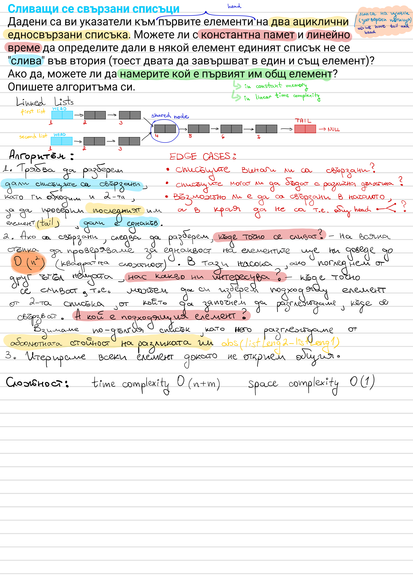

# Linked List Intersection

Given the heads of two acyclic singly linked lists, determine — in `O(1)`
extra memory and `O(n + m)` time — whether they merge into the same node,
and if so, find the first shared node.



## Approach

Checking every pair of nodes is `O(n·m)`. Instead, walk both lists with two
pointers in lockstep. When a pointer reaches the end of its list, redirect
it to the *other* list's head. Both pointers then travel `len(A) + len(B)`
nodes total before either meeting at the first common node or hitting
`null` together (no intersection) — the length difference cancels out.

**Edge cases:** lists of different lengths, lists that never intersect,
intersection at the very first node.

## Complexity

Time: `O(n + m)`, Space: `O(1)`

## Run

```bash
dotnet run --project LinkedListIntersection
```
