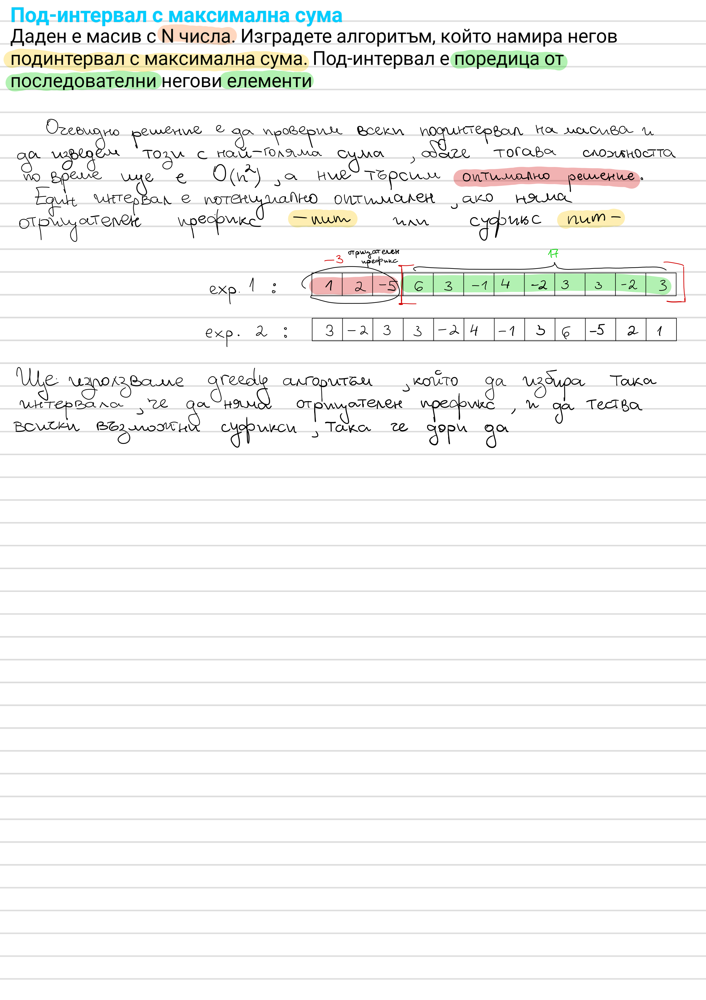

# Maximum Subarray Sum

Given an array of N numbers, find the contiguous subarray with the maximum
sum.



## Approach

Brute-forcing every subarray is `O(n²)`, but we want the optimal solution.
A subarray can only be optimal if it has no negative prefix or suffix — so
greedily extend the running sum, and reset it to the current element
whenever carrying the previous sum forward would only hurt. This is
Kadane's algorithm.

## Complexity

Time: `O(n)`, Space: `O(1)`

## Run

```bash
dotnet run --project MaximumSubarraySum
```
