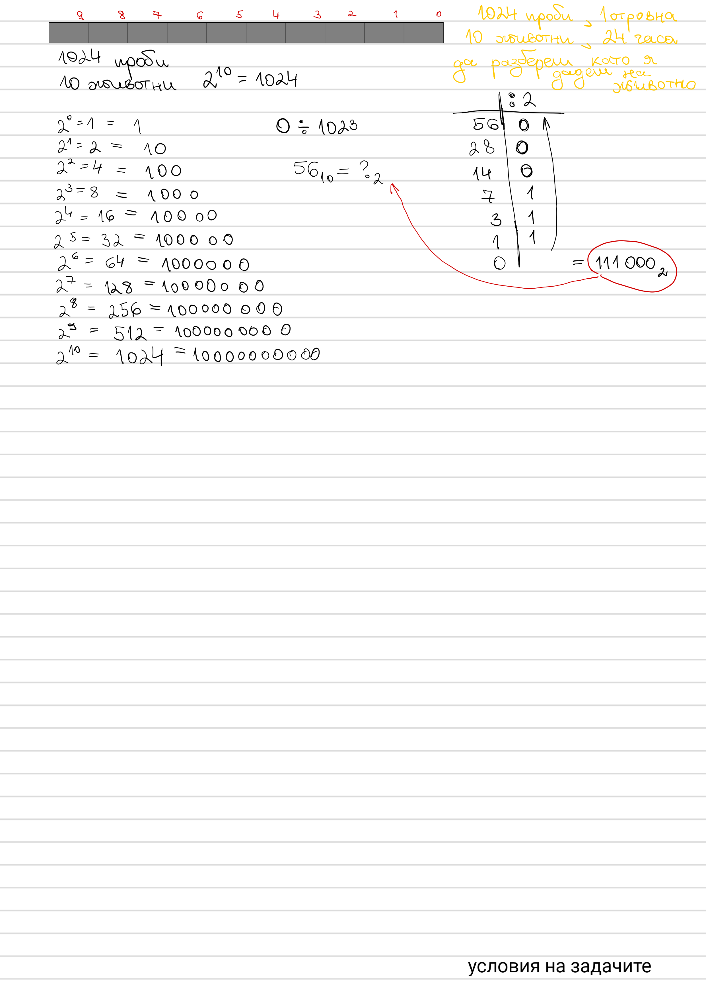

# Poisoned Vial Identification

1024 vials, exactly one poisoned, 10 test animals, 24 hours for the poison
to take effect. Identify the poisoned vial.



## Approach

Number the vials `0..1023` — that's `2^10`, so every index fits in 10 bits.
Assign animal `i` a sip from every vial whose bit `i` is `1`. After 24
hours, read off which animals died: that bit pattern **is** the poisoned
vial's index in binary.

Example: vial `56` → binary `111000` → animals 3, 4, 5 die.

## Complexity

- Animals/"queries" needed: `O(log V)` — 10 for 1024 vials
- Assignment: `O(V log V)` (V vials, `log V` animals each)

## Run

```bash
dotnet run --project PoisonedVialIdentification
```
