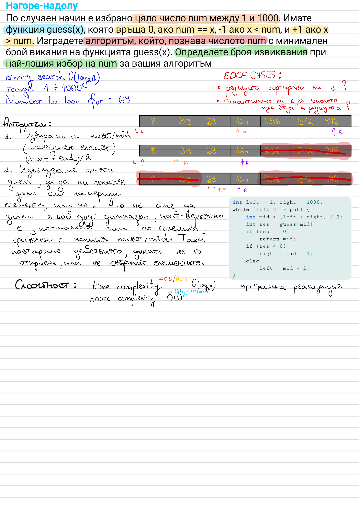

# Analytical Tasks in C#

A small C# practice repository turning handwritten algorithm notes into
working, interview-ready solutions.

## Overview

Each problem started as a handwritten note — worked through by hand first,
then implemented in C#. The original handwriting lives in
[`notewise/`](notewise) as source material; the typed-up write-up (idea,
edge cases, complexity) for each problem lives in [`notes/`](notes) next to
its solution project.

## Why This Repo Exists

- Practice analytical/algorithmic problem solving in C#
- Turn handwritten scratch work into a reviewable, version-controlled record
- Prepare for technical interviews
- Document Big O complexity for each solution

## Tech Stack

| Tool | Purpose |
| --- | --- |
| .NET 10 | Target framework |
| C# | Implementation language |
| .NET CLI | Build and run |

## Project Structure

```text
analytical-tasks/
|-- analytical-tasks.slnx
|-- notewise/
|   `-- аналитични задачки_8841604547090403343.pdf   (original handwritten notes)
|-- notes/
|   |-- images/                                      (rendered pages of the notes above, embedded in the write-ups)
|   |-- poisoned-vial-identification.md
|   |-- linked-list-intersection.md
|   |-- guess-number-higher-or-lower.md
|   `-- maximum-subarray-sum.md
|-- PoisonedVialIdentification/
|   |-- PoisonedVialIdentification.csproj
|   `-- Program.cs
|-- LinkedListIntersection/
|   |-- LinkedListIntersection.csproj
|   `-- Program.cs
|-- GuessNumberHigherOrLower/
|   |-- GuessNumberHigherOrLower.csproj
|   `-- Program.cs
`-- MaximumSubarraySum/
    |-- MaximumSubarraySum.csproj
    `-- Program.cs
```

## Problems

| Problem | Concept | Complexity | Write-up | Code |
| --- | --- | --- | --- | --- |
| Identify a poisoned vial among 1024 using 10 test animals | Binary encoding | O(log V) animals | [notes](notes/poisoned-vial-identification.md) | [`PoisonedVialIdentification`](PoisonedVialIdentification) |
| Find where two singly linked lists merge | Two pointers | O(n + m) time, O(1) space | [notes](notes/linked-list-intersection.md) | [`LinkedListIntersection`](LinkedListIntersection) |
| Guess a number 1–1000 via a higher/lower oracle | Binary search | O(log n) | [notes](notes/guess-number-higher-or-lower.md) | [`GuessNumberHigherOrLower`](GuessNumberHigherOrLower) |
| Maximum sum contiguous subarray | Kadane's algorithm | O(n) time, O(1) space | [notes](notes/maximum-subarray-sum.md) | [`MaximumSubarraySum`](MaximumSubarraySum) |

## Handwritten Source Notes

Each solution started life as a handwritten page, scanned from
[`notewise/`](notewise). Click a thumbnail to open the matching write-up.

<table>
  <tr>
    <td align="center" width="25%">
      <a href="notes/poisoned-vial-identification.md">
        
      </a>
      <br />Poisoned Vial Identification
    </td>
    <td align="center" width="25%">
      <a href="notes/linked-list-intersection.md">
        
      </a>
      <br />Linked List Intersection
    </td>
    <td align="center" width="25%">
      <a href="notes/guess-number-higher-or-lower.md">
        
      </a>
      <br />Guess Number Higher or Lower
    </td>
    <td align="center" width="25%">
      <a href="notes/maximum-subarray-sum.md">
        
      </a>
      <br />Maximum Subarray Sum
    </td>
  </tr>
</table>

## How To Run Locally

Clone the repository and build the solution:

```bash
git clone https://github.com/hristianivanov/analytical-tasks.git
cd analytical-tasks
dotnet build analytical-tasks.slnx
```

Run any single problem:

```bash
dotnet run --project <ProjectName>
```

## Repository Status

- 4 problems solved, each with its own project and write-up
- Clean build on .NET 10
- Original handwritten source notes preserved alongside the typed write-ups
